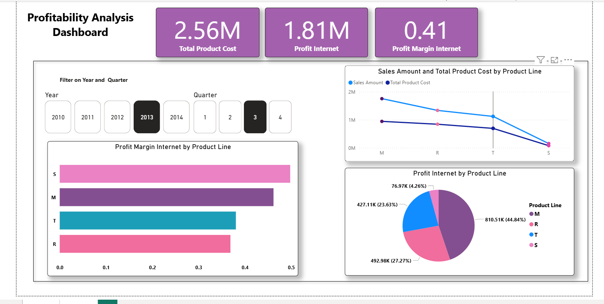

# 📊 SSAS - Power BI Profitability Analytics Dashboard

> **Enterprise-grade semantic layer with centralized profit logic and governed analytics**


This project demonstrates product line profitability analysis using **SQL Server Analysis Services Multidimensional** with **AdventureWorks DW**. The solution implements role-playing Date dimensions, MDX calculated measures with proper aggregation behavior, and centralized business logic accessed via live Power BI connection.

**Architecture:** AdventureWorks DW → SSAS Cube (MOLAP) → Power BI (Live Connection)

---

## 🎯 Business Analysis

**Questions Answered:**
- Which Product Lines generate the highest net profit?
- How do margins compare across time periods?
- What are the Sales vs Cost trends by category?

**Key Design Principle:** Business logic lives in the semantic layer, not in reports
## 📊 Data Model & Core KPIs

**Dimensional Model:**
- **Facts:** `FactInternetSales`, `FactResellerSales` 
- **Dimensions:** Product (hierarchical), Date (role-playing)
- **Storage:** MOLAP for performance

**KPIs Defined in MDX:**
| Measure | Definition | Aggregation |
|---------|------------|-------------|
| Sales Amount | Revenue from transactions | Additive |
| Total Product Cost | Cost basis of sold items | Additive |
| **Profit** | Sales Amount − Product Cost | **Additive** |
| **Profit Margin** | Profit ÷ Sales Amount | **Ratio (recalculated)** |

**Role-Playing Dates:** Single `DimDate` used for Order, Due, and Ship Date contexts

## 🧮 MDX Implementation
```mdx
CALCULATE;

CREATE MEMBER CURRENTCUBE.[Measures].[Profit Internet]
    AS [Measures].[Sales Amount] - [Measures].[Total Product Cost],
    VISIBLE = 1,
    ASSOCIATED_MEASURE_GROUP = 'Fact Internet Sales';

CREATE MEMBER CURRENTCUBE.[Measures].[Profit Margin Internet]
    AS ([Measures].[Sales Amount] - [Measures].[Total Product Cost]) / [Measures].[Sales Amount],
    VISIBLE = 1,
    ASSOCIATED_MEASURE_GROUP = 'Fact Internet Sales';
```

**Why This Matters:** Profit aggregates correctly (additive), while Margin recalculates at each query level (ratio precision).

## 📈 Power BI Dashboard

**Visual Types:**
- KPI Cards (Cost, Profit, Margin %)
- Product Line Rankings
- Trend Analysis (Sales vs Cost)
- Time Slicers (Year, Quarter)

**Philosophy:** Thin reporting layer - all business logic centralized in SSAS

### Dashboard Preview


*Product Line profitability analysis with KPI cards, margin rankings, and trend visualization*


## 🚀 Quick Setup
**Prerequisites:** SQL Server + AdventureWorksDW2022, SSAS Multidimensional, Visual Studio/SSDT, Power BI Desktop

### Option 1: Deploy Pre-built Database (Recommended)
1. **Restore SSAS Database:**
   - Copy the `.abf` file to your SSAS server
   - Open SQL Server Management Studio (SSMS)
   - Connect to Analysis Services instance
   - Right-click Databases → Restore → Browse to `.abf` file
   - Complete restore process

2. **Connect Power BI:**
   - Power BI Desktop → Get Data → Analysis Services
   - Select your SSAS server → Choose restored database
   - Build dashboard using cube measures

### Option 2: Deploy from Source
1. Open `.sln` in Visual Studio
2. Update data source connection to your SQL Server
3. Right-click project → Deploy
4. Power BI → Get Data → Analysis Services → Live Connection
5. Build dashboard using cube measures

## 💡 Key Design Decisions

| Decision | Why It Matters |
|----------|----------------|
| **Role-Playing Dates** | Single DimDate for Order/Due/Ship contexts - eliminates duplication |
| **MDX Centralized Logic** | Business rules in one place - consistent across all reports |
| **MOLAP Storage** | Pre-aggregated performance for analytical queries |
| **Separate Measure Groups** | Channel comparison ready (Internet vs Reseller) |

## 🔮 Next-Level Enhancements

- **Performance:** Partitions, aggregations, attribute relationships
- **Governance:** Security roles, data quality validation  
- **Analytics:** Time intelligence (YoY growth), contribution analysis
- **Scale:** Migration path to Tabular model for real-time scenarios

## 📁 Project Files

```
SVD_Project1/
├── Adventure Works DW2022.ds          # Data source connection
├── Adventure Works DW2022.dsv         # Data source view  
├── Adventure Works DW2022 1.cube      # Cube definition + MDX
├── Dim Product 1.dim                  # Product dimension
├── Dim Date 1.dim                     # Date dimension
├── SVD_Project1.database              # Database metadata
└── [DatabaseName].abf                 # Pre-built SSAS database backup (ready to restore)
```

**Quick Start:** Use the `.abf` file for instant deployment, or build from source using the Visual Studio project.

This project showcases enterprise semantic layer design with governed business logic, role-playing dimensions for proper aggregation handling, MDX calculations, MOLAP optimization, and a documented roadmap for scalability enhancements.

---

**💬 Questions about semantic modeling or SSAS architecture? Let's connect!**

---

*MIT License | AdventureWorks DW Sample Data*
